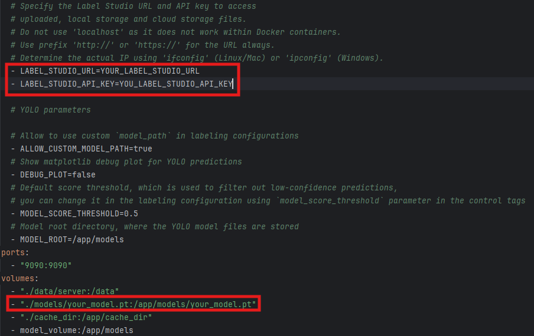
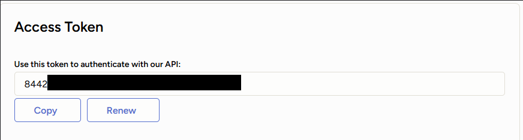
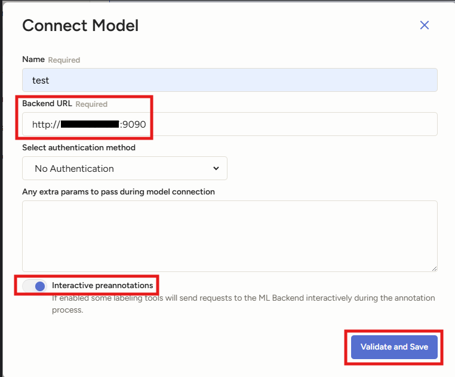

# Under Vehicle Auto Annotator for 5 Landmark Features (UVAA)

UVAA is a repository responsible for the creation and deployment of containers containing self-trained model with the aim of doing auto annotation with respect to the trained classes inside Label Studio. 

## How it works?
1. The User must have at least 1 model.pt file before running this repository.
2. The model will be loaded inside the docker container which will be built and deployed in the port allocated, as specified in the docker-compose.yml
3. The model can then be used in Label Studio for auto annotation tasks. The User must ensure that the labeling settings and model settings have been configured accordingly in Label Studio.

*Note: This repository DOES NOT HAVE MODEL TRAINING CAPABILITIES. It is purely for DEPLOYMENT OF TRAINED MODELS INTO LABEL STUDIO.*

*For Model Training and Development, refer to UVSM repository.*

## Pre-requisite
- Self-trained .pt model from UVSM repository

## 1. Installation

Download and install all essential dependencies:

```bash
pip install -r requirements.txt
```
Copy self-trained model from UVSM repository into models folder:
```
label_studio_ml/
├── examples/
	├── yolo/
     		├── models
          		├── best.pt
```
Download the Docker Desktop.exe which can be found here: https://www.docker.com/products/docker-desktop/
## 2. Configuration

*Note: You should change the configuration of the `docker-compose.yml` accordingly:*
```
yolo/
├── docker-compose.yml
```

```
- Replace LABEL_STUDIO_URL with your Label Studio URL
```
*Note: Use `ipconfig` in command prompt to check your assigned IP address.*


```
- Replace YOUR_LABEL_STUDIO_API_KEY with your own
- Replace your_model.pt with your self-trained model.pt file name as copied from UVSM
```
*Note: Label Studio API Key can be found in Label Studio under `Account & Settings` --> `Access Token`*


`Dockerfile` and `docker-compose.yml` are used to run the ML backend with Docker.
`model.py` is the main file where you can implement your own training and inference logic.
`_wsgi.py` is a helper file that is used to run the ML backend with Docker (you don't need to modify it).
`README.md` is a readme file with instructions on how to run the ML backend.
`requirements.txt` is a file with Python dependencies.
## 3. Deployment
*Note: Ensure Docker Desktop.exe is opened and running in the background.*

Proceed to YOLO Directory:

```bash
cd label_studio_ml/examples/yolo
```

Create Docker Container for Model Deployment:

```bash
docker-compose build
```

Run and Deploy Docker Container:

```bash
docker-compose up
```
Launch Label Studio:
```bash
label-studio start
```


## 4. Model Implementation

- In your label studio project, go to `Settings`--> `Model` --> `Connect Model`
- Proceed to fill in the details and the URL of the Container
- Turn on `Interactive preannotations`, then click `Validate and Save`

*Note: By default, the port of Container is 9090, as stated in docker-compose.yml*



- Navigate to `Labeling Interface` --> `Code` then use the following:
```
<View>
  <Image name="image" value="$image"/>
  <PolygonLabels name="label" toName="image" model_score_threshold="0.5" model_path="your_model.pt" opacity="0.1">
    <Label value="wheel" background="#FFA39E"/>
    <Label value="spare tyre" background="#D4380D"/>
    <Label value="fuel tank" background="#FFC069"/>
    <Label value="catalytic convertor" background="#AD8B00"/>
  <Label value="silencer" background="#00FFFF"/></PolygonLabels>
</View>
```
*Note: Replace your_model.pt with your actual model name. You may also change the model_score_threshold accordingly.*

- Click `Save` to save the changes.

*After the above has been done, head into your project and click on any of the images, it will be automatically annotated.*
# Troubleshooting

## Troubleshooting Docker Build on Windows

If you encounter an error similar to the following when running `docker-compose up --build` on Windows:

```
exec /app/start.sh : No such file or directory
exited with code 1
```

This issue is likely caused by Windows' handling of line endings in text files, which can affect scripts
like `start.sh`. To resolve this issue, follow the steps below:

### Step 1: Adjust Git Configuration

Before cloning the repository, ensure your Git is configured to not automatically convert line endings to
Windows-style (CRLF) when checking out files. This can be achieved by setting `core.autocrlf` to `false`. Open Git Bash
or your preferred terminal and execute the following command:

```
git config --global core.autocrlf false
```

### Step 2: Clone the Repository Again

If you have already cloned the repository before adjusting your Git configuration, you'll need to clone it again to
ensure that the line endings are preserved correctly:

1. **Delete the existing local repository.** Ensure you have backed up any changes or work in progress.
2. **Clone the repository again.** Use the standard Git clone command to clone the repository to your local machine.

### Step 3: Build and Run the Docker Containers

Navigate to the appropriate directory within your cloned repository that contains the Dockerfile
and `docker-compose.yml`. Then, proceed with the Docker commands:

1. **Build the Docker containers:** Run `docker-compose build` to build the Docker containers based on the configuration
   specified in `docker-compose.yml`.

2. **Start the Docker containers:** Once the build process is complete, start the containers using `docker-compose up`.

### Additional Notes

- This solution specifically addresses issues encountered on Windows due to the automatic conversion of line endings. If
  you're using another operating system, this solution may not apply.
- Remember to check your project's `.gitattributes` file, if it exists, as it can also influence how Git handles line
  endings in your files.

By following these steps, you should be able to resolve issues related to Docker not recognizing the `start.sh` script
on Windows due to line ending conversions.


## Troubleshooting Pip Cache Reset in Docker Images

Sometimes, you want to reset the pip cache to ensure that the latest versions of the dependencies are installed. 
For example, Label Studio ML Backend library is used as 
`label-studio-ml @ git+https://github.com/HumanSignal/label-studio-ml-backend.git` in requirements.txt. Let's assume that it
is updated, and you want to jump on the latest version in your docker image with the ML model. 

You can rebuild a docker image from scratch with the following command:

```bash
docker compose build --no-cache
```

## Troubleshooting `Bad Gateway` and `Service Unavailable` errors

You might see these errors if you send multiple concurrent requests. 

Note that the provided ML backend examples are offered in development mode, and do not support production-level inference serving. 

## Troubleshooting the ML backend failing to make simple auto-annotations or unable to see predictions

You must ensure that the ML backend can access your Label Studio data. If it can't, you might encounter the following issues:

* `no such file or directory` errors in the server logs.
* You are unable to see predictions when loading tasks in Label Studio.
* Your ML backend appears to be connected properly, but cannot seem to complete any auto annotations within tasks. 

To remedy this, ensure you have set the `LABEL_STUDIO_URL` and `LABEL_STUDIO_API_KEY` environment variables. For more information, see [Allow the ML backend to access Label Studio data](https://labelstud.io/guide/ml#Allow-the-ML-backend-to-access-Label-Studio-data).

